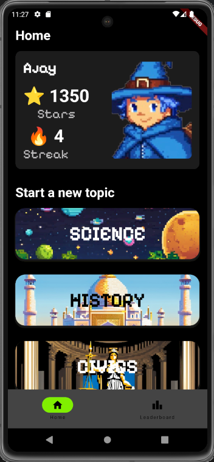
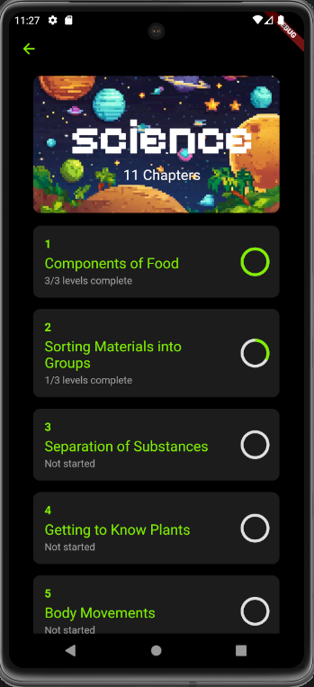
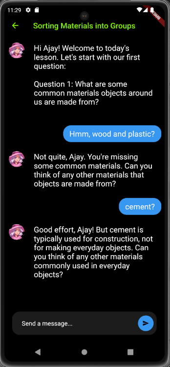

# Spark\.ai

## Overview

**Spark\.ai** is a revolutionary mobile application designed to redefine the educational experience for school students. Leveraging the power of Artificial Intelligence (AI) and gamification, we promise a unique learning journey that makes mastering school subjects not just effective but also engaging and fun.

Our philosophy is simple: we believe that education should be accessible, engaging, and efficient. In today's fast-paced world, students are often overwhelmed with hours of coaching and study. **Spark\.ai** challenges this norm by asserting that just 20 minutes a day on our platform is enough to excel in school exams. Our AI-driven approach personalizes learning for each student, ensuring that every minute spent is a step towards academic success.

## Features

- **AI-Powered Learning:** Tailored lessons that adapt to each student's learning pace and style.
- **Gamification:** Engaging and interactive learning modules that make education fun.
- **Progress Tracking:** Real-time insights into your learning journey, with streaks and rewards to keep you motivated.
- **Comprehensive Curriculum:** Covers a wide range of subjects and topics, aligning with school standards.

## Screenshots

## Our Philosophy

At **Spark\.ai**, we believe in the power of technology to transform education. We're on a mission to make learning not just a task but a delightful experience. With just 20 minutes a day, we're confident that students can achieve their academic goals and have fun along the way.

Our app is designed for the modern student – dynamic, digital-first, and always on the go. Whether you're preparing for an exam or just curious about a subject, **Spark\.ai** is your perfect learning companion.

